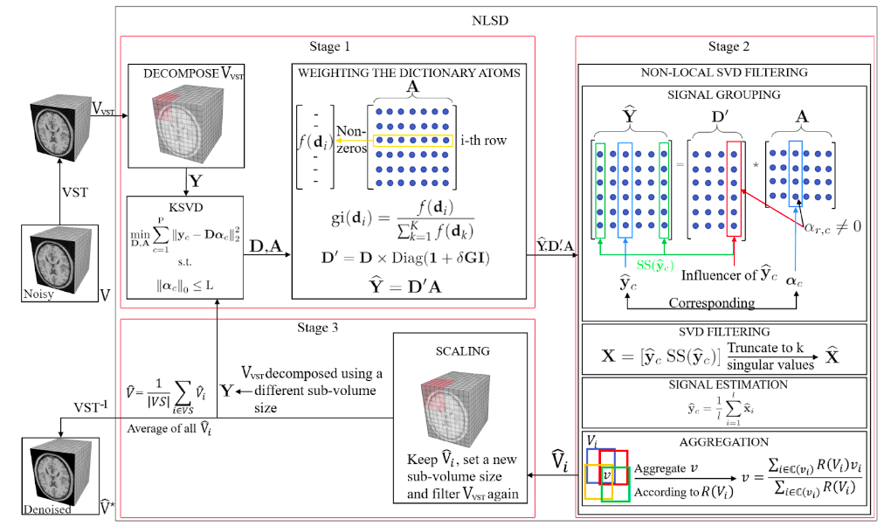
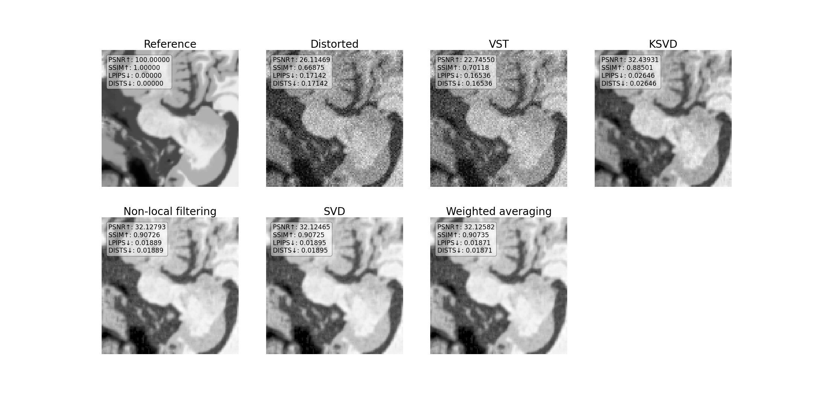
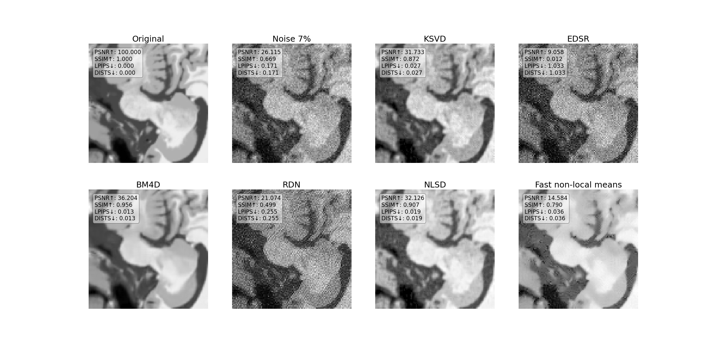

# MRI-NLSD-denoising

Implementation of an algorithm for removing noise in tomography images taken as part of a linear algebra course at AI Masters
  
In this repository I implement the algorithm proposed in [Non-Local SVD Denoising of MRI Based on Sparse Representations
](https://www.mdpi.com/1424-8220/20/5/1536/htm)

## Main methods
The algorithm consists mainly of three parts

1. Variance-Stabilization Transformation

  

   
2. KSVD matrix decomposition

  

  
3. None-local filtering

  

  
## Pipeline
This figure briefly describes main steps of the algorithm

## Results at every step of the algorithm
Incremental reduction of noise at every step of the algorithm is shown below

## Comparison with other methods
In the figure below proposed algorithm is compared to other methods of MRI denoising [Super-Resolution on IXI
](https://paperswithcode.com/sota/super-resolution-on-ixi)

